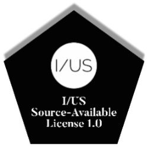

# I/US Music Assistant Songwriter

Web preview:  
https://iusmusic.github.io/IUSassistant/

## Overview

I/US Music Assistant Songwriter is a self-contained browser app for music idea capture, theory-guided generation, Magenta-based melody generation, clip arrangement, lyrics sketching, and export.

It runs with no backend and no build step. The app loads Magenta.js and Soundfont-player from CDN, uses the Web Audio API for playback, and supports Web MIDI input in compatible browsers.

## Core Logic

Core data structures include:

- a global `state` object for audio, MIDI, seed notes, generated clips, arrangement data, and cached models
- a central `els` object for all UI bindings
- lightweight namespaces inside `app.js` for `MusicUtils`, `UI`, `Settings`, `Persistence`, `AudioEngine`, `Input`, `Engine`, `Lyrics`, `Arranger`, `Exporter`, and `App`

## Current Features
(Update 18 March 2026)

- browser audio playback
- SoundFont-backed playback with browser synth fallback
- on-screen keyboard and computer keyboard note entry
- MIDI input connection in supported browsers
- microphone humming capture into seed notes
- theory-guided continuation based on scale, style, chord loop, and step length
- Magenta.js / MusicVAE model selection
- one-click full-track generation
- user-selectable track length
- drag-and-drop arrangement workflow
- bottom arrangement lane with note names, chord names, and note glyphs
- clickable playback for generated results
- BPM-based playback control
- MIDI export as a real `.mid` file
- WAV export using `OfflineAudioContext`
- lyrics suggestion panel with optional speech playback
- drum / groove generation lane
- local persistence with `localStorage`
- model load progress UI

## Technical Integrations

### Magenta.js

The app loads `@magenta/music` from CDN and uses MusicVAE checkpoints in the browser.

Current model usage includes:

- `musicvae-2bar`
- `musicvae-4bar`
- `groovae-2bar` (with fallback groove logic if loading fails)

### Web Audio

Playback is built on the Web Audio API using:

- `AudioContext` for real-time playback
- Soundfont-player when available
- oscillator fallback when SoundFont loading is unavailable
- `OfflineAudioContext` for WAV rendering

### Web MIDI

The app uses the Web MIDI API for connected MIDI devices in supported browsers.
Incoming note-on events are turned into seed material in real time.

## UX and Maintainability Updates Applied

The current version includes the requested improvements:

- stricter structure inside `app.js`
- function grouping by role
- JSDoc on key utility functions and modules
- persistent settings and arrangement state
- model load progress display
- debounced BPM and control persistence updates
- responsive arrangement area with horizontal scroll on smaller screens
- keyboard shortcut legend
- experimental extension hooks via `state.postGenerateHooks` and `state.experimentalPlugins`

## Experimental Features Included

These are now present in the current preview:

- **Drums & Groove:** fourth arrangement lane with groove generation and GrooVAE-ready model path
- **Lyrics Assistant:** chord-aware lyric phrase suggestions and browser speech playback
- **Auto Harmony:** optional pad-like harmony layer during playback
- **Live Mode:** lightweight auto-generation into future arrangement space during playback
- **WAV Export:** offline-rendered WAV download

## Preview Stack

- browser audio
- MIDI input
- theory-guided continuation
- Magenta.js / MusicVAE model selection
- SoundFont-backed playback with synth fallback

## Notes

- Web MIDI works best in Chrome and Edge.
- Audio begins only after user interaction, which is normal browser behavior.
- Microphone humming capture works best with a clear monophonic hum in a quiet room.
- MusicVAE models are loaded on demand.
- If SoundFont loading is slow or unavailable, playback falls back automatically to a browser synth.
- For best reliability, run the preview through a local server or deployed static host rather than opening the HTML file directly.

## Controls

- `A–K` play notes on the computer keyboard
- `Space` plays the arrangement
- `Shift + Space` plays the seed phrase
- `G` generates a clip
- `T` generates a full track
- `D` generates drums
- `L` suggests lyrics

## License
# I/US Source-Available License 1.0

See `LICENSE` for source-available terms.
Copyright (c) 2026 Pezhman Farhangi  
I/US Music

This repository and its contents are made available for viewing, reference, study, and limited private internal evaluation only.

## Permitted Use

You may:

- view the source code and documentation
- download the repository for personal reference, study, and internal evaluation
- make private modifications for personal, non-commercial evaluation only

## Restrictions

You may not, without prior written permission from IUS Music:

- sell this software or any modified version of it
- distribute, sublicense, publish, or share this software or any modified version of it outside the limited permissions required for access through GitHub
- use this software or any modified version of it for commercial purposes
- create or distribute derivative works for public or commercial release
- offer this software as part of a product, service, platform, device, or commercial package
- redistribute source code, compiled builds, packaged versions, or modified copies
- remove or alter copyright, ownership, or license notices

## GitHub Platform Notice

If this repository is hosted publicly on GitHub, GitHub users may have certain limited rights to view and fork the repository through GitHub’s own platform functionality, as required by GitHub’s Terms of Service. No permission is granted beyond those minimum platform rights unless explicit written permission is given by IUS Music.

## Ownership

All rights not expressly granted under this license are reserved.

This license does not transfer ownership of the software, documentation, designs, concepts, hardware direction, brand identity, or any related intellectual property.

## No Trademark Rights

This license does not grant any right to use the names I/US, IUS, I/US Music, the official logo, the visual identity, artwork, images, audio branding, or any other protected brand assets.

Trademark and brand use are governed separately.

## No Warranty

This software, hardware prototype, and all associated materials are provided "as is", without warranty of any kind, express or implied, including but not limited to merchantability, fitness for a particular purpose, and noninfringement.

In no event shall the author or copyright holder be liable for any claim, damages, or other liability, whether in an action of contract, tort, or otherwise, arising from, out of, or in connection with the software or the use or other dealings in the software.

## Contact

For licensing requests, commercial rights, redistribution requests, or permission to use protected brand assets, prior written permission must be obtained from I/US Music.
If this repository is hosted publicly on GitHub, GitHub users may have certain limited rights to view and fork the repository through GitHub’s own platform functionality, as required by GitHub’s Terms of Service. No permission is granted beyond those minimum platform rights unless explicit written permission is given by I/US Music.

# I/US Source-Available License 1.0

